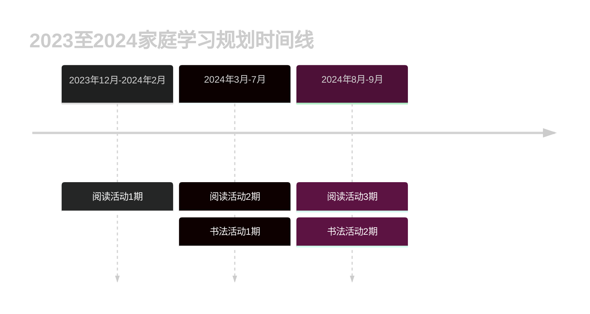

# 2023/12/02-2024/9/01 学习兴趣培养规划

## 背景

小朋友将于 2024 年 9 月开启人生求学的第 2 个阶段--**小学**。为了在这之前给他培养一些好的学习习惯，特制定两个个长期计划，旨在培养娃的:

1. 听说读写能力。
2. 主动学习意愿。
3. 自我纠错意愿或勇敢面对自己错误意愿。
4. 培养娃的成就感，感受学习带来的成长和快乐。

## 规划时间线

## 阅读活动 1 期

**一. 概述**

1. **活动内容**: 读书奖励玩具。
2. **活动目标**：

   - 大声朗读
   - 形成新阅读习惯
   - 坚持阅读

3. **时间范围**：2023 年 12 月 3 日至 2024 年 2 月 5 日
4. **实施频率**：
   - 每周末，每天 30-40 分钟
5. **材料和道具**：
   - 计时器
   - 故事书。 小篇幅，每篇故事大约 100-120 字。
6. **完成后的奖励**：
   玩具车

7. **注意事项**:
   - 提前准备好需要阅读的书籍和计时器。计时器会贯穿孩子所有的学习活动。它会帮助孩子关注活动进度和时间消耗， 最终形成时间观念。
   - 所有和读书无关的事情必须在读书之前完成。读书期间禁止上厕所，乱跑，吃饭，喝水，吃水果，玩游戏，看手机。

**二、详细计划**

**12 月： 参与阅读**

- **主要活动**：选取任意孩子感兴趣的故事书。内容不限，每个故事字数控制在 100-120 字左右，由爸爸给孩子讲解，读书时间在 15-20 分钟， 讲解过程中和孩子要有互动。读书结束可发起讨论，讨论可以和故事相关，也可以有故事引发的其他话题。互动包括：

  1. 给孩子一些简单的故事问题提问。
  2. 孩子回答时一定要给予肯定和鼓励。
  3. 和故事剧情无关的小动作/小鼓励/小互动。

- **学习目标**：

  1. 引导孩子初步接受这种阅读模式。
  2. 提升孩子的参与感。 不要单纯的说孩子“你很棒！”类似的话，一定要有客观的指标鼓励，让他明显感受到有参与感。

- **评价指标**
  1. 孩子是否适应了这种阅读模式， 如果没适应，则需要更换讲故事的方式和频率。
  2. 孩子在参与的过程中，给大人的提问/回答/反馈（不在乎内容）次数是否在增多。

**1 月：角色转换**

- **主要活动**：经过 1 个月的时间（实际只有 8 天），孩子已经开始接受这种阅读活动。 现在需要把读书的角色交给孩子，由孩子独立完成。 初期的时候，孩子部分拼音不会读，一定要给予提示和鼓励，帮助孩子建立信心。

- **学习目标**：
  1.  完成角色转换。 整篇故事由孩子独立完成，大人只做辅助工作。
  2.  阅读正确率不必多要求，不会读的部分，由大人引导，只要开口即可。 这个过程必须给予提示和鼓励。

**2 月: 角色加强**

- **主要活动**：继续由孩子主导讲故事。

- **学习目标**：
  1.  大声开口即可。
  2.  出错的部分指正出来。

**三、结果评价**
|目标|评分|评语|
|-|-|-|
|大声朗读|100|已完成
|形成阅读习惯|80|已接受，但是有时还是会抵触,表现为拖延时间和不想读。
|坚持|100|已完成。每周都在坚持。
|成就感|100|非预期内的额外收获，已有成就感，会在意大人的评价和鼓励。 对 ✅/❌ 有明显接受/抵触情绪。

## 阅读活动 2 期

**一. 概述**

1. **活动内容**: 读书奖励玩具。
2. **活动目标**：

   - 大声朗读
   - 形成新阅读习惯
   - 坚持阅读

3. **时间范围**：2024 年 3 月至 2024 年 7 月
4. **实施频率**：
   - 每周末，每天 30 分钟
5. **材料和道具**：
   - 计时器
   - 爆笑虫子故事书。 每篇故事，约 9-10 页，总计 600-800 字。
6. **完成后的奖励**：
   一辆水上游艇玩具

7. **注意事项**:
   - 提前准备好需要阅读的书籍和计时器。计时器会贯穿孩子所有的学习活动。它会帮助孩子关注活动进度和时间消耗， 最终形成时间观念。
   - 所有和读书无关的事情必须在读书之前完成。读书期间禁止上厕所，乱跑，吃饭，喝水，吃水果，玩游戏，看手机。
