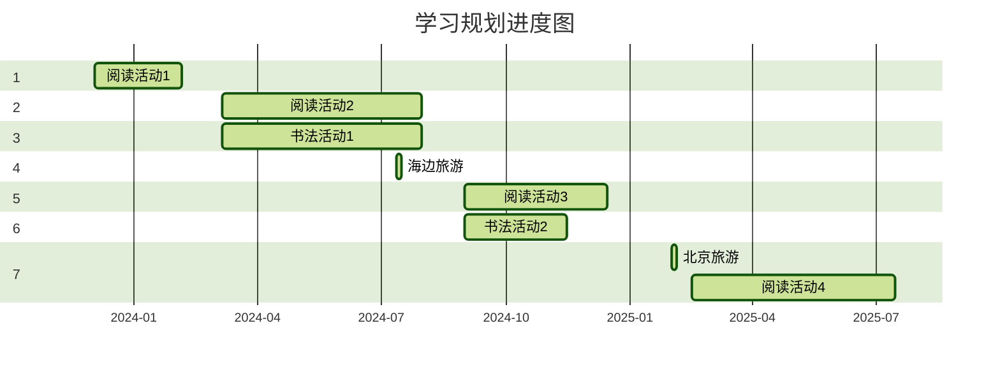

* 自动生成目录
{:toc}

# 2025/02/15-2025/07/15 学习兴趣培养规划

## 背景

TODO

## 规划时间线

```mermaid
gantt
%%{init: { 'logLevel': 'debug', 'theme': 'forest' } }%%
    title       学习规划进度图
    dateFormat  YYYY-MM-DD
    axisFormat  %Y-%m

    section 1
        阅读活动1               :active,  2023-12-03, 2024-02-05
    section 2
        阅读活动2               :active,  2024-03-06, 2024-07-31
    section 3
        书法活动1               :active,  2024-03-06, 2024-07-31
    section 4
        海边旅游                :active,  2024-07-12, 2024-07-16
    section 5
        阅读活动3               :active,  2024-09-01, 2024-12-15
    section 6
        书法活动2               :active,  2024-09-01, 2024-11-15
    section 7
        北京旅游                :active,  2025-01-31, 2025-02-04
    section 7
        阅读活动4               :active,  2025-02-15, 2025-07-15

```
## [2024](/2024)
