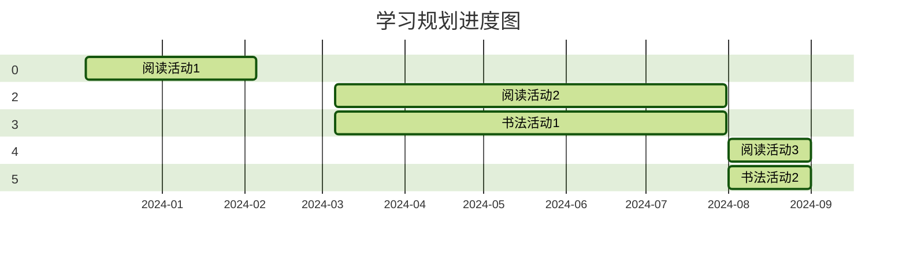

# 2023/12/02-2024/9/01 学习兴趣培养规划

## 背景

小朋友将于 2024 年 9 月开启人生求学的第 2 个阶段--**小学**。为了在这之前给他培养一些好的学习习惯，特制定两个个长期计划，旨在培养娃的:

1. 听说读写能力。
2. 主动学习意愿。
3. 自我纠错意愿或勇敢面对自己错误意愿。
4. 培养娃的成就感，感受学习带来的成长和快乐。

## 规划时间线

## 阅读活动 1 期

**一. 概述**

1. **活动内容**: 读书奖励玩具。
2. **活动目标**：

   - 大声朗读
   - 形成新阅读习惯
   - 坚持阅读

3. **时间范围**：2023 年 12 月 3 日至 2024 年 2 月 5 日，约 2 个月。
4. **实施频率**：
   - 每周末，每天 30-40 分钟
5. **材料和道具**：
   - 故事书。 小篇幅，每篇故事大约 100-120 字。
   - A4 纸打印一张表格。记录打卡结果
   - 计时器。 用作每次阅读的计时工具。
6. **完成后的奖励**：
   玩具顶部带喷水管子的消防车

7. **注意事项**:
   - 提前准备好需要阅读的书籍和计时器。计时器会贯穿孩子所有的学习活动。它会帮助孩子关注活动进度和时间消耗， 最终形成时间观念。
   - 所有和读书无关的事情必须在读书之前完成。读书期间禁止上厕所，乱跑，吃饭，喝水，吃水果，玩游戏，看手机。

**二、详细计划**

**12 月： 参与阅读**

- **主要活动**：选取任意孩子感兴趣的故事书。内容不限，每个故事字数控制在 100-120 字左右，由爸爸给孩子讲解，读书时间在 15-20 分钟， 讲解过程中和孩子要有互动。读书结束可发起讨论，讨论可以和故事相关，也可以有故事引发的其他话题。互动包括：

  1. 给孩子一些简单的故事问题提问。
  2. 孩子回答时一定要给予肯定和鼓励。
  3. 和故事剧情无关的小动作/小鼓励/小互动。

- **学习目标**：

  1. 引导孩子初步接受这种阅读模式。
  2. 提升孩子的参与感。 不要单纯的说孩子“你很棒！”类似的话，一定要有客观的指标鼓励，让他明显感受到有参与感。

- **评价指标**
  1. 孩子是否适应了这种阅读模式， 如果没适应，则需要更换讲故事的方式和频率。
  2. 孩子在参与的过程中，给大人的提问/回答/反馈（不在乎内容）次数是否在增多。

**1 月：角色转换**

- **主要活动**：经过 1 个月的时间（实际只有 8 天），孩子已经开始接受这种阅读活动。 现在需要把读书的角色交给孩子，由孩子独立完成。 初期的时候，孩子部分拼音不会读，一定要给予提示和鼓励，帮助孩子建立信心。

- **学习目标**：
  1.  完成角色转换。 整篇故事由孩子独立完成，大人只做辅助工作。
  2.  阅读正确率不必多要求，不会读的部分，由大人引导，只要开口即可。 这个过程必须给予提示和鼓励。

**2 月: 角色加强**

- **主要活动**：继续由孩子主导讲故事。

- **学习目标**：
  1.  大声开口即可。
  2.  出错的部分指正出来。

**三、结果评价**

| 目标         | 评分 | 评语                                                                                    |
| ------------ | ---- | --------------------------------------------------------------------------------------- |
| 大声朗读     | 100  | 已完成                                                                                  |
| 形成阅读习惯 | 80   | 已接受，但是有时还是会抵触,表现为拖延时间和不想读。                                     |
| 坚持         | 100  | 已完成。每周都在坚持。                                                                  |
| 成就感       | 100  | 非预期内的额外收获，已有成就感，会在意大人的评价和鼓励。 对 ✅/❌ 有明显接受/抵触情绪。 |

## 阅读活动 2 期

**一. 概述**

1.  **活动内容**: 读书奖励玩具。
2.  **活动目标**：

    - 目标 1，强化幼儿园学习的拼音。整篇文章拼读错误不超过 10 个。注意拼读连贯性。
    - 目标 2，形成主动阅读和学习的习惯。
    - 目标 3，引导勇敢面对学习中的错误和困难。
    - 目标 4，加分项，强化自我纠错能力。
    - 目标 5，加分项，控制自己的情绪，不乱发脾气。
    - 目标 6，加分项，引导自信和勇敢地说出自己的想法和遇到的问题。
    - 目标 7，加分项，初步引导思考问题。

3.  **时间范围**：2024 年 3 月至 2024 年 7 月，约 5 个月
4.  **实施频率**：
    - 每周末，每天 30 分钟
5.  **材料和道具**：
    - 爆笑虫子故事书。 每篇故事约 9-10 页，总计 600-800 字。
    - 错误本。 记录读错的拼音，记录内容包括阅读时间，拼错的发音，正确发音，耗时。
    - 表格。记录打卡结果
    - 计时器
6.  **完成后的奖励**：
    一辆水上游艇玩具，玩具是某次去兴庆公园玩的时候他看见其他小朋友玩，他也想要。

7.  **注意事项**:

    - 与<a href="#阅读活动-1-期">阅读活动 1 期</a>的注意事项一样。
    - 本次必须关注拼读正确率
    - 出错时一定要明确告知 ✅/❌ 并记录。

**二、详细计划**

**3 -4 月: 拼音加强**

- **主要活动**： 以孩子为主导阅读。
- **学习目标**：

  1.  拼读学校学习的拼音。
  2.  关注错误读音并及时指出，观察他容易出错的部分。

**5 -6 月: 共同进步**: 以我和孩子两个人共同协作

- **主要活动**： 两人轮班阅读。
- **学习目标**：

  1.  培养主动学习态度

- **6 -7 月: 勇敢面对和控制情绪**:
- **学习目标**：

  1. 需要引导孩子正视学习中遇到的问题
  2. 引导孩子学会控制情绪
  3. 自信地表达自己的想法，不愿意的事情明确说“不”， “拒绝”， “不可以”

**三、结果评价**

| 目标       | 评分 | 评语                                                                                                                                                                                                                                                                                                                 |
| ---------- | ---- | -------------------------------------------------------------------------------------------------------------------------------------------------------------------------------------------------------------------------------------------------------------------------------------------------------------------- |
| 拼音强化   | 100  | 👍 已完成。每次读书的错误大约是 3-5 个拼错， 且原因是因为粗心没看清/想象着读，而非不会读。  特别 👍。                                                                                                                                                                                                             |
| 培养主动性 | 60   | 主动性差，需要明确督促，有明显的不愿意情绪。6 月下旬教育之后，明显改善， 需要持续改进。  值得鼓励 👍。                                                                                                                                                                                                            |
| 勇敢面对   | 70   | 出错时喜欢别人给他打 ✅，不喜欢 ❌。前期有抗拒，表现为纠错时会推开大人的胳膊，不愿改正。  6 月下旬教育之后，明显改善。 表现为不推胳膊，会明确地说出需要给他 3 次错误机会，会接受 3 次错误之后再记录。 值得鼓励 👍。                                                                                         |
| 自我纠错   | 100  | 👍。有自我纠错行动。会检查出明显错误，有些错误他也检查不出。 值得鼓励 👍。                                                                                                                                                                                                                                        |
| 控制情绪   | 90   | 从 6 月中旬发现他遇到不顺心的事情会发脾气。  采取措施：  1. 以身作则。遇到问题，大人一定要以身作则，控制好自己的情绪，即使要爆发也得忍住。  2. 发脾气时的讲道理提醒  3. 通过纸质表格明确记录 ✅/❌ 是否发脾气。来帮助他控制自己的情绪。让他明显看到自己的成长。 成果显著 👍。                         |
| 自信心     | 70   | 6 月下旬之前。 遇到问题说话声音小，且不自信，害怕说出想法。 措施： 1. 以身作则。遇到问题，明确地给孩子解释说明可以像爸爸妈妈一样，大声说出来，并肯定表示“爸爸一定会支持你”， “爸爸一定会保护你”，给予孩子肯定，鼓励和安全感。 2. 表格记录每天是否自信且勇敢 ✅/❌ 。让他明确看到自己的成长。 成果显著 👍 |
| 引导思考   | 20   | 20 分是给我的。这点我没做好，在读书的过程中没有给予引导，我需要加强。                                                                                                                                                                                                                                                |

## 书法活动 1 期

**一. 概述**

1.  **活动内容**: 练习硬笔字， 可在学校兑换玩具。
2.  **活动目标**：

    - 坚持每天练字打卡

3.  **时间范围**：2024 年 5 月 1 日至 2024 年 7 月 1 日，约 2 个月。
4.  **实施频率**：

    - 每周六，学习练字
    - 周内，每天坚持练字

5.  **完成后的奖励**：

    - 学校会发随堂贴纸。 收集贴纸兑换玩具奖励。

**三、结果评价**

| 目标     | 评分 | 评语                                                |
| -------- | ---- | --------------------------------------------------- |
| 写字规范 | 100  | 相较学习之前，进步很大。值的鼓励 👍。               |
| 握笔姿势 | 50   | 不及格。 写一到两个字之后就需要大人提醒。需要改进。 |
| 下笔力度 | 50   | 不及格。 握笔姿势导致下笔力道很大。需要改进。       |
| 坐姿     | 50   | 不及格。坐姿不标准，头总是下垂                      |

# 2024 年幼儿园阶段学习，性格，习惯等方面总结

待总结
